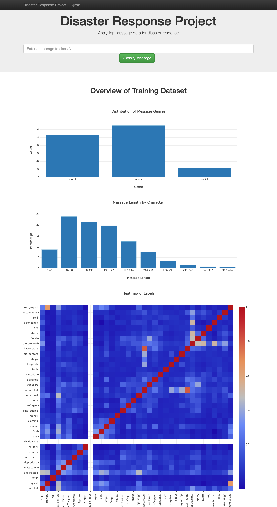

# Disaster Response Pipeline Project

### Project Overview
In this project, I analyzed disaster data from [Figure Eight](https://www.figure-eight.com/) to build a model for an API that classifies disaster messages. The machine learning pipeline that I created can categorize these messages/events so that the messages can be sent to an appropriate disaster relief agency.

The project also include a web app where an emergency worker can input a new message and get classification results in several categories. The web app will also display visualizations of the data.

Here's the file structure of the project:

- ipynb # code sketches
    - ETL Pipeline Preparation.ipynb
    - ML Pipeline Preparation.ipynb 

- app
    - template
        - master.html  # main page of web app
        - go.html  # classification result page of web app
    - run.py  # Flask file that runs app

- data
    - disaster_categories.csv  # data to process 
    - disaster_messages.csv  # data to process
    - process_data.py  # ETL process
    - InsertDatabaseName.db   # database to save clean data to

- models
    - train_classifier.py # model builder
    - classifier.pkl  # saved model 

- README.md

### Tools Used
env: [Anaconda distribution](https://www.anaconda.com/distribution/) of Python 3.7

packages: numpy, pandas, re, sqlalchemy, nltk, sklearn, pickle

### How to run the project:
1. Run the following commands in the project's root directory to set up your database and model.

    - To run ETL pipeline that cleans data and stores in database
        `python data/process_data.py data/disaster_messages.csv data/disaster_categories.csv data/DisasterResponse.db`
    - To run ML pipeline that trains classifier and saves
        `python models/train_classifier.py data/DisasterResponse.db models/classifier.pkl`

2. Run the following command in the app's directory to run your web app.
    `python run.py`

3. Go to http://0.0.0.0:3001/

### Screenshot

